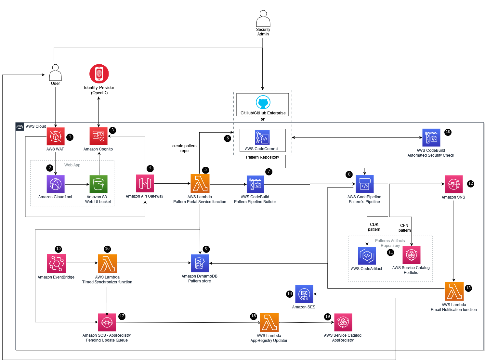

### Table of contents

- [Application Pattern Orchestrator on AWS](#application-pattern-orchestrator-on-aws)
- [Licence](#licence)
- [About this solution](#about-this-solution)
  - [Solution overview](#solution-overview)
  - [Benefits](#benefits)
- [Architecture overview](#architecture-overview)
  - [Architecture reference diagram](#architecture-reference-diagram)
  - [Solution components](#solution-components)
- [Prerequisites](#prerequisites)
  - [AWS account](#aws-account)
  - [Tools](#tools)
  - [GitHub or GitHub Enterprise account](#github-or-github-enterprise-account)
- [Configure the solution before deployment](#configure-the-solution-before-deployment)
  - [Configuration](#configuration)
  - [Build and deploy](#build-and-deploy)
    - [CDK deployment parameters](#cdk-deployment-parameters)
- [File structure](#file-structure)
- [Access the solution web UI](#access-the-solution-web-ui)
- [Uninstall the solution](#uninstall-the-solution)
- [Collection of operational metrics](#collection-of-operational-metrics)
- [Documentation](#documentation)

---

## Application Pattern Orchestrator on AWS

Application Pattern Orchestrator (APO) is an AWS Solution that helps customers establish and manage an internal catalog of reusable, repeatable, well-architected, secure-by-design, and production-ready cloud infrastructure patterns for use by application development and engineering teams throughout their organizations.

## Licence

Licensed under the Apache License Version 2.0 (the "License"). You may not use this file except in compliance with the License. A copy of the License is located at

    http://www.apache.org/licenses/

or in the "license" file accompanying this file. This file is distributed on an "AS IS" BASIS, WITHOUT WARRANTIES OR CONDITIONS OF ANY KIND, express or implied. See the License for the specific language governing permissions and limitations under the License.

## About this solution

This solution offers a set of integrated components that provide an end-to-end orchestration framework to allow decentralized contribution, implement automated compliance validation, centralize approval and publishing, and lifecycle notifications of an enterprise’s internal application-driven cloud infrastructure patterns.

You can use this README file to find out how to build, deploy, use and test the code. You can also contribute to this project in various ways such as reporting bugs, submitting feature requests or additional documentation. For more information, refer to the [Contributing](CONTRIBUTING.md) topic.

### Solution overview

Using this solution, application and technology teams can use a self-service web user interface (UI) to submit their application patterns as CloudFormation or CDK for automatic validation, manual review, approval and publishing to AWS Service Catalog as AWS Service Catalog products for CloudFormation-based patterns and to AWS CodeArtifact as software packages for CDK-based patterns.

This solution is intended for deployment in an enterprise by IT infrastructure and security architects, security administrators, developers, and DevSecOps professionals who have practical experience with the AWS Cloud.

### Benefits

1. **Self-service, low touch experience friendly to developers**
   Facilitate contribution of application patterns from your distributed engineering teams in a decentralized manner. Automatic validation accelerates basic compliance checks allowing developers to continue to use familiar tools, such as Git, to publish, review, and iterate on pattern feedback in an asynchronous manner. Reduce reliance on central teams and improve overall productivity.
1. **Drive consistency and standardization of controls across your organizations**
   Shift governance to the left through the use of patterns incorporating guardrails, for new applications, at scale. Automatically validate pattern security, architecture, and compliance, against organization specific policy-as-code. Embed attributes to be automatically inherited by new applications using the underlying patterns. Apply controls and governance consistently based on such attributes.
1. **Centralized discovery of approved application patterns**
   Allow your engineering teams to quickly browse and search for patterns via a centrally accessible, unified user interface built for application developers. Automatically notify users of the availability of new patterns, and updates to existing patterns.
1. **Integrated with AWS Service Catalog and Code Artifact**
   Orchestrate the end-to-end publishing of approved patterns to customizable destination repositories, with out-of-the-box support for AWS Service Catalog for CloudFormation (Cfn) based patterns, and AWS CodeArtifact for Cloud Development Kit (CDK) based patterns.

---

## Architecture overview

### Architecture reference diagram

The following diagram represents the solution's architecture design.



### Solution components

The solution deploys the following components that work together to provide pattern governance and catalog functionality:

- **Application pattern portal**: A web UI that allows the user to create new patterns, its attributes and provides a storefront to browse and search for patterns.
- **Application patterns pipeline builder**: Provisions governed pipelines for evaluating and publishing application patterns upon a pattern’s submission request. Pipelines are provisioned per application pattern.
- **Policy evaluation and security review microservice**: Provides an interface to plug in a policy as code implementation such as CFN Nag.
- **Provisioned publishing pipeline(s)**: AWS CodePipeline based pipeline responsible for publishing a pattern to AWS Service Catalog for CloudFormation based patterns and to AWS CodeArtifact for CDK based patterns.
- **Application pattern subscriber email notification**: An email notification mechanism that allows the users to subscribe to the patterns they are interested in and receive notification whenever a new version of the patterns is published.

---

## Prerequisites

### AWS account

- **A CDK bootstrapped AWS account**: You must bootstrap your AWS CDK environment in the target region you want to deploy, using the AWS CDK toolkit's cdk bootstrap command. From the command line, authenticate into your AWS account, and run `cdk bootstrap aws://<YOUR ACCOUNT NUMBER>/<REGION>`. For more information, refer to the [AWS CDK's How to bootstrap](https://docs.aws.amazon.com/cdk/v2/guide/bootstrapping.html) page.
- **Production access for Amazon SES**: This solution uses Amazon SES for sending email notifications to application pattern’s subscribers. In order to use this feature, ensure that Amazon SES (in your account) is in a production environment, and not in the sandbox environment. For more information, refer to the [Moving out of the Amazon SES sandbox page](https://docs.aws.amazon.com/ses/latest/dg/request-production-access.html) page.
- **Your AWS account should be part of an AWS Organization**: This prerequisite is only applicable for application patterns that are of the CloudFormation type, and needs to be shared across accounts using AWS Service Catalog, as currently, the AWS Service Catalog AppRegistry attribute groups can only be [shared to AWS accounts within an organization](https://docs.aws.amazon.com/ram/latest/userguide/shareable.html#shareable-sc-appregistry). This prerequisite does not apply to CDK-based application patterns.

### Tools

- The latest version of the [AWS CLI](https://aws.amazon.com/cli/), installed and configured.
- The latest version of the [AWS CDK](https://docs.aws.amazon.com/cdk/latest/guide/home.html).
- [Nodejs](https://docs.npmjs.com/getting-started) version ^14.17.0.
- Yarn latest version installed

  - `npm install --global yarn`

### GitHub or GitHub Enterprise account

The solution assumes the user is using GitHub to host their code repositories. The solution supports both GitHub Teams and GitHub Enterprise plans. Under GitHub Enterprise, the solution supports both Enterprise Cloud and Enterprise Server options.

A complete list of prerequisites related to GitHub/GitHub Enterprise are listed:

- **GitHub Organization**: The solution assumes that an organization exists in the GitHub account. The pattern repositories will be created in this organization.
- **GitHub Organization Owner Account**: The organization owner is the only account that is allowed to create a [GitHub App](https://docs.github.com/en/developers/apps/getting-started-with-apps/about-apps) which is required to create an AWS CodeStar connection to GitHub, GitHub Enterprise Cloud or GitHub Enterprise server.
- **AWS CodeStar connection to GitHub, GitHub Enterprise Cloud or GitHub Enterprise server**:
  - The solution integrates with GitHub, GitHub Enterprise Cloud or GitHub Enterprise server using AWS CodeStar connection. To create a CodeStar connection to GitHub or GitHub Enterprise Cloud, refer to the [Create a connection to GitHub guide](https://docs.aws.amazon.com/dtconsole/latest/userguide/connections-create-github.html). To create a CodeStar connection to GitHub Enterprise Server, refer to the [Create a connection to GitHub Enterprise Server guide](https://docs.aws.amazon.com/dtconsole/latest/userguide/connections-create-gheserver.html).
  - Install the GitHub app in the organization: As part of creating a CodeStar connection, a GitHub app is installed to establish the connection between AWS and GitHub. Install the GitHub app in the organization.
  - GitHub app permissions.
    - The GitHub app must have Admin permissions granted as Read & Write. The Admin permission for the GitHub app is required because when a new pattern is created by the solution, its code repository is created with master/main branch as protected. When the pattern’s publishing pipeline runs, it upgrades package versions and tries to push the change directly to the master/main branch. As the master/main branch is protected, only admins have the permissions to directly push to the [protected branches](https://docs.github.com/en/repositories/configuring-branches-and-merges-in-your-repository/defining-the-mergeability-of-pull-requests/about-protected-branches).
    - For GitHub and GitHub Enterprise in Cloud, the GitHub app by default has Read and Write Admin permissions.
    - For GitHub Enterprise Server, you will need to manually grant the Admin permissions to the GitHub app. For more information on how to grant permissions to the GitHub app, refer to the [Editing a GitHub App's permissions guide](https://docs.github.com/en/developers/apps/managing-github-apps/editing-a-github-apps-permissions). Ensure the permissions changes are accepted by the Organization account before you deploy.
- **AWS SSM Parameter created with value of AWS CodeStar connection ARN**:
  - Once the AWS CodeStar connection has been created successfully using the previous step, create an AWS SSM parameter with the name as `githubConnectionArn` and value as `AWS CodeStar connection ARN`. User has the flexibility to provide a different name for AWS SSM parameter, however, that would require setting `githubConnectionArnSsmParam` property in source/cdk.json. Please refer to [Configuration section](#configuration) for details.
- **GitHub personal access token**:
  - Create a [personal access token](https://docs.github.com/en/authentication/keeping-your-account-and-data-secure/creating-a-personal-access-token) from a GitHub account that is a member of the organization. This token is required by the solution to create pattern’s code repository in the organization and also to initialize it with an initial commit.
  - Token permissions should have repo scope.
  - Store the GitHub personal access token as a secret in plain text form in AWS Secrets Manager with the name `githubTokenSecretId`. It must NOT be encrypted using AWS KMS Customer Managed Key and should only be encrypted using the AWS managed key for Secrets Manager (`aws/secretsmanager`). User has the flexibility to provide a different name for the secret in AWS Secrets Manager, however, that would require setting `githubTokenSecretId` property in source/cdk.json. Please refer to the [Configuration section](#configuration) for details. Example AWS CLI command to create the secret:
  
    ```
    aws secretsmanager create-secret --name githubTokenSecretId --description "GitHub personal access token" --secret-string "<GIHUB_TOKEN>"
    ```

---

## Configure the solution before deployment

Before you deploy the Application Pattern Orchestrator on AWS solution, review the architecture and prerequisites sections in this guide. Follow the step-by-step instructions in this section to configure and deploy the solution into your account.

Time to deploy: Approximately 15 minutes

### Configuration

Use the `source/cdk.json` file to configure the solution.

**GitHub/GitHub Enterprise configuration (optional)**

As mentioned in the [prerequisite section](#github-or-github-enterprise-account), by default, the solution expects a fixed name for creating a GitHub token as a secret in AWS Secrets Manager and for AWS SSM parameter for storing the AWS CodeStar connection ARN. The below configiration provides an option to the user to provide a custom name for both:

```
"githubTokenSecretId": "<The AWS Secret Manager secret name that stores the GitHub personal access token>",
"githubConnectionArnSsmParam": "<The SSM parameter name that stores the AWS CodeStar connection ARN to integrate with GitHub/GitHub Enterprise>"
```

**Data retention policy configuration (optional)**

By default, all solution data (S3 buckets, DynamoDB tables) will be removed when you uninstall the solution. To retain this data, in the configuration file, set the `retainData` flag to `true`.

**Network configuration (optional)**

- VPC CIDR Range

  - By default the solution would create a new VPC for deployment with default CIDR range as 10.0.0.0/16. However, this can be overridden using below configuration:
    ```
    "vpcCidr": "x.x.x.x/x",
    ```

- Private connectivity between GitHub Enterprise Server and solutions VPC

  - This is only applicable for GitHub Enterprise Server that requires a private connectivity with solution’s VPC. For such a scenario, the solution utilises [AWS Route 53 Resolvers](https://docs.aws.amazon.com/Route53/latest/DeveloperGuide/resolver-getting-started.html) to provide private connectivity between GitHub Enterprise server and solution’s VPC and provides below configuration option to specify the GitHub Enterprise domain name and GitHub Enterprise domain resolver IP addresses. These resolver IP addresses are on the GitHub Enterprise server side that can resolve the incoming DNS requests to resolve the GitHub enterprise domain name.

    ```
    "githubDomain": "<GitHub Enterprise domain name>",
    "githubDomainResolverIpAddresses": "<comma seperator IP addresses of resolver>"
    ```

**Identity Provider configuration (optional)**

Users can sign into the solution web UI either directly through the user pool, or federate through a third-party identity provider (IdP) that supports OpenID Connect authentication. To federate through a third-party identity provider via OpenID Connect, add the following parameters to `source/cdk.json`:

```
"identityProviderInfo": {
    "providerName": "<The IdP provider name>",
    "clientId": "<The client Id configured in IdP>",
    "clientSecretArn": "<The ARN of the secret in AWS secret manager which stores the client secret. It is optional if the client does not have a secret.>",
    "authorizeScopes": "<A list of OpenId scopes which should contain at least openid and profile.>",
    "oidcIssuer": "<Verifiable identifier for an issuer. An issuer identifier is a case-sensitive URL that uses the HTTPS scheme that contains scheme, host, and optionally, port number and path components and no query or fragment components.>",
    "attributeMapping": "<A mapping of IdP attributes to standard and custom user pool attributes. It is optional if IdP already output email attribute with the name 'email'. >"
    }
```

Example: Identity provider configuration to federate through Auth0.

```
"identityProviderInfo": {
    "providerName": "Auth0",
    "clientId": "hVFMGsQolzgNdCRWjWxjb5HslvtERPOW",
    "clientSecretArn": "arn:aws:secretsmanager:<region>:<account-id-number>:secret:<secret-name>-<random-6-characters>",
    "authorizeScopes": ["openid", "profile", "email"],
    "oidcIssuer": "https://dev-abcdefgx.us.auth0.com",
    "attributeMapping": {
      "email": "EMAIL",
      "username": "sub"
    }
  }
```

**AWS WAF configuration (optional)**

This solution provisions AWS WAF Web ACL for API Gateway resources, by default. For a CloudFront distribution WAF Web ACL, the solution allows users to associate their existing AWS WAF Web ACL for CloudFront with the CloudFront distribution created by the solution. Refer to the configuration options below for configuring your AWS WAF Web ACL. Note: The WAF configuration is optional. If you need to configure it, add this information to `source/cdk.json`.

```
"wafInfo": {
  "allowedIPsForApi": "<An array of strings that specifies zero or more IP addresses or blocks of IP addresses in Classless Inter-Domain Routing (CIDR) notation for accessing API Gateway endpoints.>",
  "rateLimitForApi": "<Maximum number of calls from the same IP address in a 5 minutes period for accessing API Gateway endpoints. Defaults to 1000>",
  "wafCloudFrontWebAclArn": "<Existing AWS WAF Web ACL ARN to associate with CloudFront.>"
}
```

Example WAF Configuration:

```
"wafInfo": {
    "allowedIPsForApi": [
        "x.x.x.x/x"
    ],
    "rateLimitForApi": 2000,
    "wafCloudFrontWebAclArn": "arn:aws:wafv2:us-east-1:xxxxxxxxxxxx:global/webacl/CloudFront-ACL-Test/xxxxxxxx-xxxx-xxxx-xxxx-xxxxxxxxxxxx"
}
```

### Build and deploy

1. Clone the solution source code from the GitHub repository.
2. Open the terminal and navigate to the directory created in step 1.
3. Navigate to the source directory: `cd source`
4. Build the code: `npm run all`
5. Run the below command and pass the appropriate parameters based on the specific user environment. Please refer to the [CDK deployment parameters section](#cdk-deployment-parameters) to know more about the parameters.

```
npm run deploy -- --parameters githubUrl=<GITHUB_ENTERPRISE_URL> --parameters githubOrganization=<GITHUB_ORGANIZATION> --parameters patternType=<PATTERN_TYPE> --parameters adminEmail=<ADMIN_EMAIL> --parameters sendAnonymousData=Yes --require-approval=never
```

#### CDK deployment parameters

You can pass the following parameters to the `npm run deploy` command as specified in [Build and deploy](#build-and-deploy) section.

| Parameter            | Description                                                                                                                                                                                                                                                                                                                                                                                         |
| -------------------- | --------------------------------------------------------------------------------------------------------------------------------------------------------------------------------------------------------------------------------------------------------------------------------------------------------------------------------------------------------------------------------------------------- |
| `githubUrl`          | (Optional) The GitHub Enterprise Server URL. This option is only required for GitHub Enterprise Server, and is not required for GitHub or GitHub Enterprise Cloud.                                                                                                                                                                                                                                  |
| `githubOrganization` | The organization name in GitHub/GitHub Enterprise where the pattern’s code repositories will be created.                                                                                                                                                                                                                                                                                            |
| `patternType`        | (Optional) Defaults to `CloudFormation`. The type of application patterns that the solution would enable. Valid values are: `CloudFormation` (CloudFormation based patterns are automatically published to AWS Service Catalog as products), `CDK`(CDK based patterns are automatically published to AWS CodeArtifact as npm packages), `All` (Enables both CloudFormation and CDK based patterns). |
| `adminEmail`         | The solution creates a default user with this email address to login to the solution's UI. This has to be a valid email address as you will receive the temporary password on this email address.                                                                                                                                                                                                   |
| `sendAnonymousData`  | (Optional) Defaults to `Yes`. Send anonymous operational metrics to AWS. We use this data to better understand how customers use this solution and related services and products.                                                                                                                                                                                                                   |

---

## File structure

Upon successfully cloning the repository into your local development environment but **prior** to running the initialization script, you will see the following file structure in your editor.

```
|- .github/ ...                 - resources for open-source contributions.
|- source/                      - all source code, scripts, tests, etc.
  |- blueprint-ui               - Web UI code.
  |- blueprint-infrastructure   - pattern pipeline builder
  |- lambda                     - Portal lambda function source code and unit tests code
|- .gitignore
|- CHANGELOG.md                 - changelog file to track changes between versions.
|- CODE_OF_CONDUCT.md           - code of conduct for open source contribution.
|- CONTRIBUTING.md              - detailed information about open source contribution.
|- LICENSE.txt                  - Apache 2.0 license.
|- NOTICE.txt                   - Copyrights for this solution.
|- THIRDPARTY_LICENSE.txt       - Copyrights licenses for third party software that was used in this solution
|- README.md                    - this file.
```

---

## Access the solution web UI

After the solution stack has been deployed and launched, you can sign in to the web interface.

1. Find the website URL from your deployment output starting with `ApoStack.RapmFrontendCloudFrontURL` and open it in your browser. We recommend using Chrome. You will be redirected to the sign in page that requires username and password.
2. Sign in with the email address specified during deployment (`adminEmail`) and use the temporary password received via email after deployment. You will receive a temporary password from `no-reply@verificationemail.com`.
3. During the sign in, you are required to set a new password when signing in for the first time.
4. After signing in, you can view the solution's web UI.

---

## Uninstall the solution

You can unisntall the solution by deleting the stacks from the AWS CloudFormation console.

- Go to the AWS CloudFormation console, find and delete the following stacks (in the specified order)
  - All the stacks with the prefix `BlueprintInfrastructureStack`
  - The stack name you used to deploy the solution.

---

## Collection of operational metrics

This solution collects anonymous operational metrics to help AWS improve the quality and features of the solution. For more information, including how to disable this capability, refer to the [implementation guide](https://docs.aws.amazon.com/solutions/latest/application-pattern-orchestrator-on-aws/collection-of-operational-metrics.html).

## Documentation

- [API Reference](./source/lambda/blueprintgovernanceservice/API.md)
- [Implementation Guide](https://docs.aws.amazon.com/solutions/latest/application-pattern-orchestrator-on-aws/welcome.html)
- [Landing page](https://aws.amazon.com/solutions/implementations/application-pattern-orchestrator-on-aws/)

---

Copyright 2022 Amazon.com, Inc. or its affiliates. All Rights Reserved.

Licensed under the Apache License Version 2.0 (the "License"). You may not use this file except in compliance with the License. A copy of the License is located at

    http://www.apache.org/licenses/

or in the "license" file accompanying this file. This file is distributed on an "AS IS" BASIS, WITHOUT WARRANTIES OR CONDITIONS OF ANY KIND, express or implied. See the License for the specific language governing permissions and limitations under the License.
